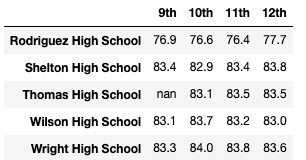

# Overview
## School District Analysis
Using Pandas and Jupyter Notebook, we are analyzing math and reading scores of students across multiple high schools to view how different metrics affect school and student performance. Due to reports of academic dishonesty for 9th graders at Thomas High Schools, we have replaced their scores with NaN and repeated the school district analysis. 
#
# Results
## School District Metrics in the Updated Analysis

How does replacing the 9th graders scores affect the following metrics:

- **The district summary** shows the number of students decreased by 461 which is the number of 9th graders at Thomas High School. It also shows a decrease within tenths of a percent for average scores and passing percentages except for the average reading score. 

- **The school summary** shows differences within tenths of a percent for average scores and passing percentages of Thomas High School students. 

 

- **Thomas High School's performance relative to other schools** is unchanged as it is still the second highest performing school in this analysis.

- **Math and reading scores by grade** are not affected except for the exclusion of Thomas High School 9th graders' scores.  

    

- **Scores by school spending** show that average scores are higher for the inner spending ranges of $585-629 and $630-644.  

- **Scores by school size** show no difference between the initial and updated analysis. 

- **Scores by school type** show no difference between the initial and updated analysis. 

#
# Summary
## Changes in the updated school district analysis 

- The district summary shows the number of students decreased by 461 to exclude the number of 9th graders at Thomas High School. 
- Across all schools, average scores and overall passing percentages are higher in the intial analysis. The average reading score is the only metric that is unchanged from the initial to the updated analysis.
- For Thomas High School 10th-12th grade students, the same is true. The average math score and all passing percentages show a decrease after the 9th grade scores were replaced. 
- Performance of schools with spending ranges between $585 and $644 has increased.
